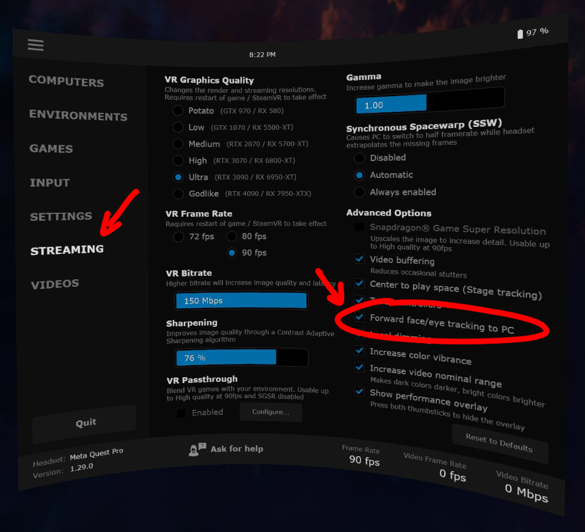

import {PageCard} from '@site/src/components/Cards.tsx'
import {TroubleShootTable, CustomLink, TextColor} from '@site/src/components/Utils.tsx'
import ReactPlayer from 'react-player'
import Link from '@docusaurus/Link';
import useBaseUrl from '@docusaurus/useBaseUrl';

# Quest Pro

The Meta Quest Pro provides eye gaze tracking, detailed eye expression tracking, and face tracking.
All eye and face tracking hardware is internal to the device (no additional hardware setup required).
All eye and face tracking data is accessed via Meta’s Face and Eye OpenXR extensions.
There is currently no way for VRCFT to simultaneously extract data from the headset and send eye and face tracking to the Quest version of VRChat, so the following solutions are only for PCVR.
Previously, a beta version of the native VRChat Quest client included built in eye tracking support without the need for VRCFaceTracking. This version is discontinued and is no longer available.

:::danger
The Quest Pro has been shown to be *extremely* susceptable to sweat damage.
There have been a non-trivial number of users who have experienced the exact same failure mode
of Eye-tracking not working after sweat ingress.
If you plan on exercising, dancing, or doing other sweat-inducing activities,
please take extra precautions against having sweat or other liquids reach the face-facing part of the headset.
:::

## Why is this setup required?

The Quest Pro provides developers with both eye and face tracking data from a single, contained device, making it easy for native Quest developers to incorporate.
However, having it only accessible through Meta’s Oculus OpenXR extensions means there must be an OpenXR application using the Oculus runtime running somewhere.
Depending on your chosen PCVR connection method, setup may or may not be trivial.

## Setup

The basic Quest Pro setup flow:
1. [Enable Eye and Face Tracking on the Headset](#enable-eye-and-face-tracking-on-the-headset)
2. Set up desired PCVR connection method
3. Install corresponding VRCFT module

### Enable Eye and Face Tracking on the Headset

1. Open up the Settings in your Quest Pro headset, and navigate to "Movement Settings"
2. Select the "Natural Facial Expressions" tab on the left, then Enable Natural Facial Expressions
3. Select the "Eye Tracking" tab on the left, then Enable Eye Tracking. If you haven’t already, calibrate your eye tracking

    

The Quest Pro currently has **4** readily available face-tracking compatible PCVR connection methods, listed in no particular order:

- [Oculus Link/Airlink](#oculus-linkairlink-setup)
- [ALXR](#alxr-setup)
- [ALVR](#alvr-setup)
- [Virtual Desktop](#virtual-desktop-setup)

Oculus Link/Airlink is Meta’s own PCVR streaming solution, and is generally more straight-forward to set up (the PCVR part) and network stable, but also is limited in customization.
ALXR/ALVR are open-source projects and thus has many for features and customizability in the PCVR connection as compared to Airlink, but also may have more bugs, quirks, and generally may be harder to use.
Virtual Desktop is commonly seen as the "best" PCVR streaming solution, but it is not *free*, unlike all the other options.

If you need a general recommendation for what to use

- If you don't want to spend money: you should start with **Oculus Link/Airlink** as it is free and the offical PCVR method.
- If you don't mind spending money: you should use **Virtual Desktop** for ease of use.

With any option, the user is expected to have the VR PC and the Quest Pro on the same network, with the PC ideally connected to the network via ethernet cable (for wireless PCVR),
or Quest Pro connected to the PC with a high-quality USB 3.0+ cable (for "wired" PCVR, Virtual Desktop excluded).
You can learn more about improving your Quest PCVR streaming experience with the many guides available online.

### Oculus Link/Airlink Setup

Prefer a video? Community member Ninka has graciously created another tutorial video for the Quest Pro and VRCFT 5.0+ that goes over the entire setup procedure,
including the VRCFT module installation for the Oculus Link/Airlink module "Quest Pro OpenXR".

    <ReactPlayer controls url='https://www.youtube.com/watch?v=Keh__Lw7dEk'/>

#### Enable Developer Mode on the Headset

Instructions originally from https://learn.adafruit.com/sideloading-on-oculus-quest/enable-developer-mode

1. [Set up a Meta Oculus developer account](https://developer.oculus.com/sign-up/)
    * A developer account is ***necessary*** (for now) as the eye and face OpenXR extensions are currently considered "developer features" if to be accessed from the PC Oculus runtime.
   It is rather trivial to apply for and there is no check for being a "real organization".
2. Install the Oculus ("Meta Quest") app on mobile device (if it isn’t already) and login with your (developer) Oculus account. Register your headset in the app.
3. In the Oculus mobile App, tap Menu at the bottom right, then Devices. Select your Quest Pro, then go to `Settings -> Developer Mode` and set the Developer Mode switch to enabled.
    * Reboot the headset after enabling Developer Mode.

    

<!-- :::warning
Do **not** skip these steps. Please follow the instructions for setting the headset to developer mode using the mobile app before proceeding.
Even if you think it is in developer mode already, **follow the instructions and do it again anyways**.
::: -->

1. [**MAKE SURE YOUR HEADSET IS IN DEVELOPER MODE**](#enabling-developer-mode-on-the-headset)
2. [**MAKE SURE YOUR HEADSET HAS EYE AND FACE TRACKING ENABLED**](#enabling-eye-and-face-tracking-on-the-headset)
3. Install and start the [Oculus PC application](https://www.oculus.com/download_app/?id=1582076955407037) (if it isn't already).
4. Follow setup instructions for logging in and adding your Quest Pro to `Devices`.
5. In the Oculus PC application, click on `Settings` in the left sidebar, then `General` tab. Turn on `Unknown Sources`, and set the `OpenXR Runtime` to Oculus.

:::warning
**SET THE OPENXR RUNTIME TO OCULUS**. Do not forget to do this step!
:::

    

6. Navigate to the `Beta` tab. Enable `Developer Runtime Features`, `Eye tracking over Oculus Link`, and `Natural Facial Expressions over Oculus Link`.
   - Note that `Passthrough over Oculus Link` option *may* cause issues and unless you are making or using PCVR apps that use Oculus passthrough, you should just leave this disabled.
:::warning
If you do not see these options, you did not follow the previous steps correctly.
:::

    

7. Install one of the following modules from the VRCFaceTracking module registry:
   - **Oculus Quest OpenXR Module**
   - **ALXR Local Module** | [Learn more about the ALXR module configuration options](https://github.com/korejan/VRCFT-ALXR-Modules#module-settings)

### ALXR Setup

:::note
Using ALXR will require you to [sideload applications to you Quest](#using-sidequest-to-side-load-quest-apps)
:::

1. [**MAKE SURE YOUR HEADSET HAS EYE AND FACE TRACKING ENABLED**](#enabling-eye-and-face-tracking-on-the-headset)
2. Download and install the latest ALXR client *and server* from the [ALXR-nightly](https://github.com/korejan/ALXR-nightly/releases) repository.
If this is your first time using ALXR, follow the [Usage guide](https://github.com/korejan/ALVR/wiki/ALXR-Client#usage) and [Android-specific client install instructions](https://github.com/korejan/ALVR/wiki/ALXR-Client#android-all-flavors---questpicogenericetc)
3. Install the **ALXR Remote** module from the VRCFaceTracking module repository.
4. Open the `ALXRModuleConfig.json` found in the installed module directory.
  - You may need to navigate to `C:\Users\[username]\AppData\Local\Packages\96ba052f-0948-44d8-86c4-a0212e4ae047_d7rcq4vxghz0r\LocalCache\Roaming\VRCFaceTracking\` to find the module directory and config json.
  - [Learn more about the ALXR module configuration options](https://github.com/korejan/VRCFT-ALXR-Modules#module-settings)
5. In `ALXRModuleConfig.json`, in the "RemoteConfig" section set "ClientIpAddress" to the headset IP, this can be found in the ALVR server dashboard.
  - If the client is being run on the same host as the server (e.g. alxr windows client), use localhost IP (default, `127.0.0.1`) and set the server to TCP protocol.
6. Restart VRCFT to reinitialize the ALXR Remote Module with the updated configuration

### ALVR Setup

:::note
Using ALVR will require you to [sideload applications to you Quest](#using-sidequest-to-side-load-quest-apps)
:::

1. [**MAKE SURE YOUR HEADSET HAS EYE AND FACE TRACKING ENABLED**](#enabling-eye-and-face-tracking-on-the-headset)
2. Install the ALVR **Nightly** streamer on the PC and **Nightly** client on the Quest Pro if you have not already.
Follow the [ALVR Install instructions](https://github.com/alvr-org/ALVR/wiki/Installation-guide#nightly) if this is your first time using ALVR.
3. Launch ALVR streamer and set `Eye and face tracking` to `VRCFaceTracking`.
4. Start the client on the Quest Pro and connect.
5. Install the **ALVR Module** from the VRCFaceTracking module repository.

<!-- #### If you are planning on using a USB cable instead of Wi-Fi streaming for the ALVR connection

1. Follow the [Official ALVR Community Instructions](https://github.com/alvr-org/ALVR/wiki/ALVR-wired-setup-(ALVR-over-USB)) for setting up the USB connection.
2. Change the text in the `questProIP` file to `127.0.0.1` -->

### Virtual Desktop Setup

:::note
This following setup assumes that Virtual Desktop has already been purchased from the **Quest Store** in the headset and the Virtual Desktop Streamer PC-side app has been installed on the PC.
Please refer to Virtual Desktop's built-in setup instructions to get started with using Virtual Desktop.
:::

0. Install the [1.29.0 Beta version of Virtual Desktop](https://github.com/guygodin/VirtualDesktop/releases/tag/v1.29.0). If 1.29.0 has been promoted to live release, or the current live version of Virtual Desktop is greater than 1.29.0, please use the most recent live version of Virtual Desktop.
1. [**MAKE SURE YOUR HEADSET HAS EYE AND FACE TRACKING ENABLED**](#enabling-eye-and-face-tracking-on-the-headset)
2. In the Virtual Desktop app *on the headset*, go to the "Streaming" tab, and enable the option `Forward face/eye tracking to PC`

3. Start Virtual Desktop Streamer if you have not already and establish headset connection to the PC.
4. Install the **Virtual Desktop VRCFT tracking module**

:::note
To let the Virtual Desktop VRCFT module properly initialize, make sure to start VRCFT with the Virtual Desktop module installed *after* you start the Virtual Desktop Streamer program on the PC.
:::

## Modules

There are a total of **5** different VRCFT modules that can be used for the Quest Pro.

<!-- Install the **"QuestProOpenXRTrackingModule"** from the <Link to={useBaseUrl('docs/vrcft-software/vrcft#module-registry')}  target="_blank" rel="noopener noreferrer">VRCFaceTracking Module Registry</Link>

Interested in the source code? Check out the [QuestProOpenXRTrackingModule source repository](https://github.com/regzo2/VRCFaceTracking-QuestProOpenXR)
(Currently maintained by Regzo2 / Azmidi / "Mitchell Moment") -->

<!-- 

    <PageCard name="Quest Pro OpenXR Module" url="../intro" description="Creates a psuedo-headless OpenXR application to pull data from Facebook's Eye/Face OpenXR extensions"/>
    <PageCard name="ALXR Local Module" url="../intro" description="Creates a psuedo-headless ALXR (OpenXR) instance to pull data from OpenXR extensions"/>
    <PageCard name="ALXR Remote Module" url="../intro" description="Creates a psuedo-headless ALXR (OpenXR) instance to pull data from OpenXR extensions"/>
    <PageCard name="ALVR Module" url="../intro" description="Creates a psuedo-headless ALXR (OpenXR) instance to pull data from OpenXR extensions"/>
    <PageCard name="Virtual Desktop Module" url="../intro" description="Creates a psuedo-headless ALXR (OpenXR) instance to pull data from OpenXR extensions"/>

 -->

- If you are using Oculus Link/Airlink, you have the options of:
    1. **[Quest Pro OpenXR module](https://github.com/regzo2/VRCFaceTracking-QuestProOpenXR)**
    2. **[ALXR Local module](https://github.com/korejan/VRCFT-ALXR-Modules)**
- If you are using ALXR, you will need to use the **[ALXR Remote module](https://github.com/korejan/VRCFT-ALXR-Modules)**.
- If you are using ALVR, you will need to use the **[ALVR module](https://github.com/alvr-org/VRCFT-ALVR)**.
- If you are using Virtual Desktop, you will need to use the **[Virtual Desktop module](https://github.com/guygodin/VirtualDesktop.VRCFaceTracking)**.

Links are to Module source repositories, for those interested in contributing and improving the modules.
All modules are readily available for installation via the VRCFaceTracking built in module registry.
[Learn how to install modules from the module registry](../intro/getting-started.mdx#installing-the-vrcfacetracking-module).

<!-- Follow the module installation instructions in the respective module pages, and learn about the avalible PCVR streaming methods by continuing down to [Setup](#setup)! -->

## Tips and Tricks

### Using Sidequest to Side-load Quest Apps

1. Install SideQuest (Advanced Installer) on your computer. https://sidequestvr.com/setup-howto
   - The SideQuest application will have a built-in tutorial for the following steps.
2. Connect your Quest Pro headset to your computer with a *data-transfer* USB cable.
Once connected you will be prompted to "Allow USB debugging" and "Allow File Access". Make sure to allow both.
(You should also check the *Always allow from this computer* box to prevent the message from popping up again later)
3. Use SideQuest to install `alxr-client-quest.apk` to your Quest Pro. Click the *"Install APK file from folder"* button, then select the downloaded `alxr-client-quest.apk` in the file prompt.

    

4. SideQuest should have a green notification bar show up at the bottom saying the operation was successful.

:::note
You may need to uninstall the previous version of the app you are trying to sideload if it exists and SideQuest fails the current app install.
:::

5. In your Apps Library, you will need to set the category of shown apps to "Unknown Sources" to see the sideloaded application.
You will need to tap the Search bar first before you see the category filter dropdown.

    

### Aligning Play Spaces with SteamVR Lighthouse-tracked Devices

To use Vive trackers or other SteamVR Lighthouse tracked devices with the Quest Pro, you'll need to use **OpenVR-SpaceCalibrator**.
While the [original from pushrax](https://github.com/pushrax/OpenVR-SpaceCalibrator) will work, many "Mixed VR" users have found the continous calibration forks
to be generally better, such as [bdunderscore's fork](https://github.com/bdunderscore/OpenVR-SpaceCalibrator/tree/continuous-cal), or more recently,
[ArcticFox8515's fork](https://github.com/ArcticFox8515/OpenVR-SpaceCalibrator) of bdunderscore's fork.

We would recommend using ArcticFox8515's fork for now as it is the most recent and improves upon the original. 

### Using Index Controllers with the Quest Pro with Link/Airlink

Download these [Powershell Scripts (Discord Link)](https://discord.com/channels/849300336128032789/1033745772979699775/1056009844701806643)

To run, right-click the file -> `"Run with Powershell"`

You may have problems with running Powershell scripts downloaded from the internet (for good reason!). You can learn about [getting around Microsoft's default script security](https://adamtheautomator.com/run-powershell-script/).

### Using Index Controllers with the Quest Pro with Virtual Desktop

*Before* launching SteamVR from Virtual Desktop: 
In the Virtual Desktop "Streaming" tab, untick the "Track controllers" option under "Advanced Options" in the Streaming tab.

    

<!-- ### Using Index Controllers with the Quest Pro with ALVR/ALXR

The customizability of ALVR allows a few options in this regard. All following mentioned settings can be found in the "Headset" tab of the ALVR settings.

- Option 1: Completely disable the Quest Pro controllers using the checkbox next to "Controllers"
- Option 2: Set the Controller emulation to "HTC Vive Tracker". This allows real controllers such as the Index Controllers to take precedence in SteamVR, and allow
  for using the Quest Pro controllers for manual playspace calibration. -->

## Troubleshooting

### NO MODULES LOADED / Stuck on "Initializing Modules"

Whenever you see this, the cause is because the currently installed module failed to initialize (or you're not even giving enough time for the module to fail attempting to load...).
Switch to the VRCFT Output Log tab and find the relevant error message.

  
Error in headset: <code>com.oculus.bodyapiservice keeps stopping</code>

  <TroubleShootTable
  cause="You do not have developer mode enabled on both the PC Oculus program and for the headset from the Oculus phone app.">

  <i>Carefully</i> re-run through <Link to="##oculus-linkairlink-setup">the Link/Airlink setup</Link>, paying careful attention to all the steps.
   
  Double-check that "Developer Runtime Features" is enabled in the Oculus PC program and that <b>Developer Mode is switched on for the Quest Pro in the Oculus phone app</b>.
  If you can't find these options, your Oculus/Meta account is not a Meta Quest Developer account, or may need to be re-verified as a Developer account.
  Log in to or sign up at the <Link to="https://developer.oculus.com/">Meta Quest Developer Center</Link> to verify/resolve developer account status.

  </TroubleShootTable>

  
[QuestProTrackingModule] Error: [QuestOpenXR] Failed to GetFaceExpressionWeightsFB

  <TroubleShootTable
  cause="There is some permission in the setup that was not set correctly.">

  <i>Carefully</i> re-run through <Link to="#oculus-linkairlink-setup">the setup</Link>, paying careful attention to all the steps.
   
  Double-check that "Developer Runtime Features" is enabled in the Oculus PC program and that <b>Developer Mode is switched on for the Quest Pro in the Oculus phone app</b>.
  If you can't find these options, your Oculus/Meta account is not a Meta Quest Developer account, or may need to be re-verified as a Developer account.
  Log in to or sign up at the <Link to="https://developer.oculus.com/">Meta Quest Developer Center</Link> to verify/resolve developer account status.

  </TroubleShootTable>

  
[QuestProTrackingModule] Error: [QuestOpenXR] Failed to create Face Tracker

  <TroubleShootTable
  cause="There is some permission in the setup that was not set correctly or Quest Pro headset is not connected.">
  
  <i>Carefully</i> re-run through <Link to="#oculus-linkairlink-setup">the setup</Link>, paying careful attention to all the steps.
   
  Double-check that "Developer Runtime Features" is enabled in the Oculus PC program and that <b>Developer Mode is switched on for the Quest Pro in the Oculus phone app</b>.
  If you can't find these options, your Oculus/Meta account is not a Meta Quest Developer account, or may need to be re-verified as a Developer account.
  Log in to or sign up at the <Link to="https://developer.oculus.com/">Meta Quest Developer Center</Link> to verify/resolve developer account status.
    
  Also make sure that your Quest Pro is actively connected via Link/Airlink before starting VRCFT!

  </TroubleShootTable>

  
[QuestProTrackingModule] Error: [QuestOpenXR] Failed to get XrSystemID

  <TroubleShootTable
  cause="There is some permission in the setup that was not set correctly or Quest Pro headset is not connected.">
  
  <i>Carefully</i> re-run through <Link to="#oculus-linkairlink-setup">the setup</Link>, paying careful attention to all the steps.
  Doubly make sure that you have Oculus set as your OpenXR runtime in the Oculus Desktop app settings.
    
  Also make sure that your Quest Pro is actively connected via Link/Airlink before starting VRCFT!
  </TroubleShootTable>

  
[QuestProTrackingModule] Error: [QuestOpenXR] Failed to create session" and I am NOT using a laptop / eGPU

  <TroubleShootTable
  cause="There is something preventing an OpenXR session from being created for the Quest Pro">
  
  <i>Carefully</i> re-run through <Link to="#oculus-linkairlink-setup">the setup</Link>, paying careful attention to all the steps.
  Doubly make sure that you have Oculus set as your OpenXR runtime in the Oculus Desktop app settings.
    
  Also make sure that your Quest Pro is actively connected via Link/Airlink before starting VRCFT!
  </TroubleShootTable>

  
[QuestProTrackingModule] Error: [QuestOpenXR] Failed to create session" and I AM using a laptop / eGPU

  <TroubleShootTable
  cause="There is something preventing an OpenXR session from being created for the Quest Pro, possibly related to Oculus trying to default init on laptop's iGPU">
  
  Make sure that you have Oculus set as your OpenXR runtime in the Oculus Desktop app settings.
  Also make sure that your Quest Pro is actively connected via Link/Airlink before starting VRCFT.

  Try to turn off using integrated GPU through your laptop's BIOS or control center program.

  Alternatively, use Windows Settings to force VRCFaceTracking to "High Performance" (use discrete GPU).
  Open Windows Settings and navigate through System -> Display -> Graphics Settings (a small link under "Multiple Displays" section in Win10, or under "Related Settings" in Win11).

    
    

  </TroubleShootTable>

  
[Virtual Desktop] Error: [VirtualDesktop] Failed to open MemoryMappedFile. Make sure Virtual Desktop Streamer (v1.29 or later) is running.

  <TroubleShootTable
  cause="VRCFaceTracking was started before Virtual Desktop">

  Close VRCFaceTracking, start Virtual Desktop Streamer, reopen VRCFaceTracking.

  If VRCFaceTracking is started before SteamVR/VRChat is launched from Virtual Desktop, the output log may show a warning that "Tracking is not active".
  However, after launching SteamVR/VRChat (*from Virtual Desktop*) the Virtual Desktop module should log that "Tracking is now active!".

  </TroubleShootTable>

### General Problems

  
When using Oculus Link/Airlink, I cannot see SteamVR because Oculus is stuck loading some random app

  <TroubleShootTable
  cause="The nature of the way VRCFaceTracking must pull data from the Oculus OpenXR runtime from the PC is inherently hacky, effectively running 2 VR programs at once.">
    If you started SteamVR first, you can simply switch back to SteamVR in the Oculus Dash.
    You can also try switching up the program startup sequence, starting VRCFaceTracking then SteamVR through the desktop Steam app (not through the Oculus Dash in the headset).
    Yet another solution is to use <Link to="https://github.com/LibreQuest/OculusKiller">OculusKiller</Link> to avoid dealing with the Oculus Dash entirely, though this has its own downsides. 
  </TroubleShootTable>

  
"I'm <i>not getting any visible errors anywhere</i> and the Module loads, but VRC only receives 0 values for all parameters (and VRC loaded a non-zero number of parameters from config)"

  <TroubleShootTable
  cause="Meta Moment">
  Try toggling the eye and face tracking enables in the headset settings, and restarting your headset completely.
  </TroubleShootTable>

  
"Oculus Link/Airlink: My playspace calibration resets if I take off the headset"

  <TroubleShootTable
  cause="When the Quest headset enters sleep mode after detecting you have taken off the headset, it loses it's original reference space to which the SteamVR space was calibrated to.">
  Download the <Link to="https://developer.oculus.com/documentation/unity/ts-odh/">Meta Quest Developer Hub</Link> and follow the instructions for <i>Connect Headset to MQDH</i> and <i>Disable proximity sensor and guardian</i>.
  This will prevent the headset from entering sleep, but does mean your headset stays fully active even if you take it off.
  Alternatively, use another PCVR streaming method that supports Stage Tracking (Virtual Desktop, ALXR, ALVR).
  </TroubleShootTable>

Don't see your problem here? Think your problem might be unrelated to the module but something else? Take a look at the [VRCFT software page](../vrcft-software/vrcft.mdx) or search in the <TextColor color="#5763ee">#hardware-software-help</TextColor> forum in the <CustomLink to="discord"/>.

<!-- - **ALXR/ALVR methods: "[ERROR] No connection could be made because the target machine actively refused it"**
  - Cause: The ALXR VRCFT server is not running.
  - Solution: Usually the problem is related to [missing a step](#oculus-linkairlink-setup)
     and the ALXR log may make it clear as to what step exactly was forgotten. -->
