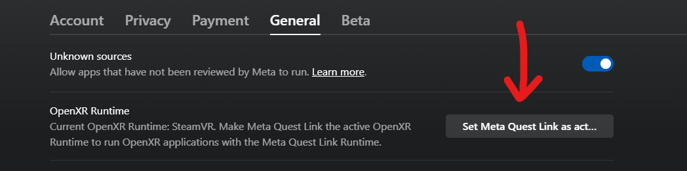
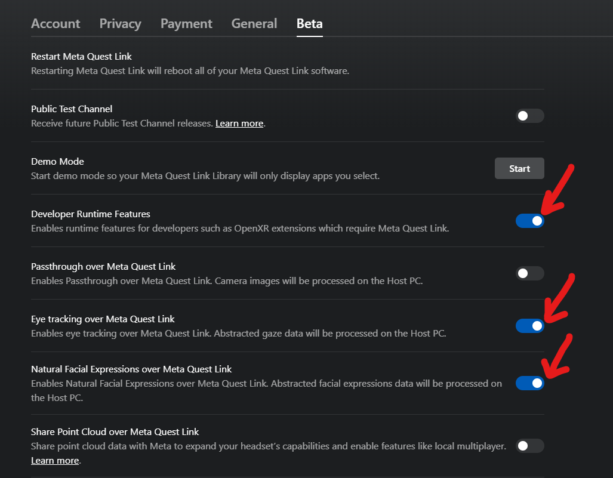
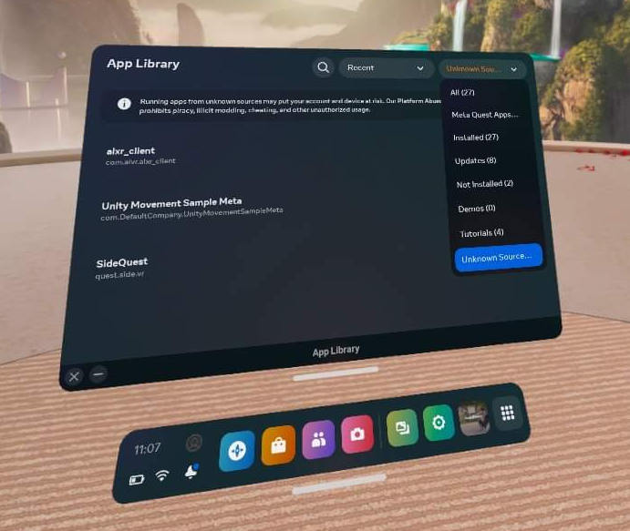

import {PageCard} from '@site/src/components/Cards.tsx'
import {TroubleShootTable, CustomLink, TextColor} from '@site/src/components/Utils.tsx'
import ReactPlayer from 'react-player'
import Link from '@docusaurus/Link';
import useBaseUrl from '@docusaurus/useBaseUrl';

# Quest Pro

The Meta Quest Pro provides eye gaze tracking, detailed eye expression tracking, and face tracking.
All eye and face tracking hardware is internal to the device (no additional hardware setup required).
All eye and face tracking data is accessed via Meta’s Face and Eye OpenXR extensions.

## Why is this setup required?

The Quest Pro provides developers with both eye and face tracking data from a single, contained device, making it easy for native Quest developers to incorporate.
However, having it only accessible through Meta’s Oculus OpenXR extensions means there must be an OpenXR application using the Oculus runtime running somewhere.
There is currently no way for VRCFT to simultaneously extract data from the headset and send eye and face tracking to the Quest version of VRChat, so the following solutions are only for PCVR.
Note that native Eye Tracking support is now in open beta for the Quest version of VRChat for use with the Quest Pro, which does **not** require the use of VRCFaceTracking to function.

## Setup

:::info
While an ALXR module exists, Korejan has not released it yet. This page will only cover the Oculus Link/Airlink method.
:::
:::warning
There is currently **no way** to use Virtual Desktop with face tracking. VD simply just doesn't access the face tracking API and it seems pretty low priority on the VD developer's list of priorities.
:::

The Quest Pro currently has 1 readily available face-tracking compatible PCVR connection methods:

- Oculus Link (or Airlink)

Follow all the sub-sections: [Enable Developer Mode on the Headset](#enable-developer-mode-on-the-headset), [Enable Eye and Face Tracking on the Headset](#enable-eye-and-face-tracking-on-the-headset), and [Oculus Link/Airlink PC Setup](#oculus-linkairlink-pc-setup) to complete setup.

Prefer a video? Community member Ninka has graciously created another tutorial video for the Quest Pro and VRCFT 5.0+ that goes over the entire setup procedure,
including the VRCFT module installation.

    <ReactPlayer controls url='https://www.youtube.com/watch?v=Keh__Lw7dEk'/>

<!-- The user is free to choose whatever method they prefer more. ALXR is an open-source project and thus has many for features and customizability in the PCVR connection as compared to Airlink, but also has more bugs or quirks.
Oculus Link/Airlink is Meta’s own PCVR streaming solution, and is generally more straight-forward to set up and network stable, but also is limited in customization.

In both cases the user is expected to have the VR PC and the Quest Pro on the same network, with the PC ideally connected to the network via ethernet cable. 
You can learn more about improving your Quest PCVR streaming experience with the many guides available online.  -->

### Enable Developer Mode on the Headset

Instructions originally from https://learn.adafruit.com/sideloading-on-oculus-quest/enable-developer-mode

1. [Set up a Meta Oculus developer account](https://developer.oculus.com/sign-up/)
    * A developer account is ***necessary*** (for now) as the eye and face OpenXR extensions are currently considered "developer features".
   It is rather trivial to apply for and there is no check for being a "real organization".
2. Install the Oculus ("Meta Quest") app on mobile device (if it isn’t already) and login with your (developer) Oculus account. Register your headset in the app.
3. In the Oculus mobile App, tap Menu at the bottom right, then Devices. Select your Quest Pro, then go to `Settings -> Developer Mode` and set the Developer Mode switch to enabled.
    * Reboot the headset after enabling Developer Mode.

### Enable Eye and Face Tracking on the Headset

1. Open up the Settings in your Quest Pro headset, and navigate to "Movement Settings"
2. Select the "Natural Facial Expressions" tab on the left, then Enable Natural Facial Expressions
3. Select the "Eye Tracking" tab on the left, then Enable Eye Tracking. If you haven’t already, calibrate your eye tracking

### Oculus Link/Airlink PC Setup

1. [**MAKE SURE YOUR HEADSET IS IN DEVELOPER MODE**](#enabling-developer-mode-on-the-headset)
2. [**MAKE SURE YOUR HEADSET HAS EYE AND FACE TRACKING ENABLED**](#enabling-eye-and-face-tracking-on-the-headset)
:::warning
Do **not** skip these steps. Please follow the instructions for setting the headset to developer mode using the mobile app before proceeding. 
Even if you think it is in developer mode already, **follow the instructions anyways**.
:::
3. Install and start the [Oculus PC application](https://www.oculus.com/download_app/?id=1582076955407037) (if it isn't already).
4. Follow setup instructions for logging in and adding your Quest Pro to `Devices`.
5. In the Oculus PC application, click on `Settings` in the left sidebar, then `General` tab. Turn on `Unknown Sources`. Set the `OpenXR Runtime` to Oculus
:::warning
**SET THE OPENXR RUNTIME TO OCULUS**. This is the *second* most forgotten step of Quest Pro setup.
:::

6. Navigate to the `Beta` tab. Enable `Developer Runtime Features`, `Eye tracking over Oculus Link`, and `Natural Facial Expressions over Oculus Link`.
You can try enabling `Passthrough over Oculus Link` but that *may* cause issues. 
:::note
If you do not see these options, you did not follow the previous steps correctly.
:::
   
7. PC and Headset setup complete! Please continue to [Modules](#modules) for which VRCFT module to install to use the Quest Pro with VRCFT.

<!-- ### ALVR/ALXR Setup

1. Install SideQuest (Advanced Installer) on your computer. https://sidequestvr.com/setup-howto
   - The SideQuest application will have a built-in tutorial for the following steps.
2. [**Set your headset to developer mode using the Oculus mobile app**](#enabling-developer-mode-on-the-headset) and..
3. [Enable Headset Eye and Face Tracking](#enabling-eye-and-face-tracking-on-the-headset)
:::warning
Do **not** skip these steps. Please follow the instructions for setting the headset to developer mode using the mobile app before proceeding. 
Even if you think it is in developer mode already, **follow the instructions anyways**. 
:::
4. Connect your Quest Pro headset to your computer with a *data-transfer* USB cable.
Once connected you will be prompted to "Allow USB debugging" and "Allow File Access". Make sure to allow both.
(You should also check the *Always allow from this computer* box to prevent the message from popping up again later)
Your headset should now be ready to be used with SideQuest.
5. Download the [latest ALXR **Quest** Client (`alxr-client-quest.apk`)](https://github.com/korejan/ALXR-experimental/releases/)
6. Use SideQuest to install `alxr-client-quest.apk` to your Quest Pro. Click the *"Install APK file from folder"* button, then select the downloaded `alxr-client-quest.apk` in the file prompt.

7. Download [ALVR Server v18.2.3 (`alvr_server_windows.zip`)](https://github.com/alvr-org/ALVR/releases/tag/v18.2.3)
   - Optionally, you can try [this custom build of alvr_server v18 from korejan](https://drive.google.com/file/d/1aA1j4H97mSKebjS_puCd4-FUKnxZMBfC/view?usp=share_link) that includes the encoding changes found in alvr v19
    :::note
    Newer versions of ALVR server are incompatible with ALXR client, so only use the linked options here (for now!)
    :::
8. Unzip ``alvr_server_windows.zip`` somewhere convenient, then launch ``ALVR Launcher.exe``. Follow the initial setup procedure in the launched ALVR Server app.
9. Once the ALVR Server is up and running, launch the ``alxr_client`` app that you installed earlier on your Quest Pro.
In your Apps Library, you will need to set the category of shown apps to "Unknown Sources" to see the installed ``alxr_client``.

10. With ALXR client running on the headset, go back to the ALVR Server PC application and make sure you're on the "Connections" tab.
There should now be a Meta Quest Pro in the "New Clients" list, with a "Trust" button on the right side of its entry.
Click "Trust" to allow the ALVR server app to make the connection to the ALXR client app on the Quest Pro.
Back in the headset, SteamVR should now be streamed from the PC to the headset.
 

#### If you are planning on using a USB cable instead of Wi-Fi streaming for the ALXR/ALVR connection

1. Follow the [Official ALVR Community Instructions](https://github.com/alvr-org/ALVR/wiki/Using-ALVR-through-a-USB-connection) for setting up the USB connection.
2. Change the text in the `questProIP` file to `127.0.0.1` -->

## Modules

<!-- There are two different VRCFT modules that can be used for the Quest Pro. 
If you are using the ALXR program for streaming PCVR to the headset, you *must* use Korejan's ALXR module.
Otherwise if using Oculus Link/Airlink for PCVR streaming, either module will work. -->

<!-- We'll bring the neat pagecards back once module pages become a thing -->

Install the **"QuestProOpenXRTrackingModule"** from the <Link to={useBaseUrl('docs/vrcft-software/vrcft#module-registry')}  target="_blank" rel="noopener noreferrer">VRCFaceTracking Module Registry</Link>

Interested in the source code? Check out the [QuestProOpenXRTrackingModule source repository](https://github.com/regzo2/VRCFaceTracking-QuestProOpenXR)
(Currently maintained by Regzo2 / Azmidi / "Mitchell Moment")

<!-- 

    <PageCard name="TofuLemon's OpenXR Module" url="../intro" description="Creates a psuedo-headless OpenXR application to pull data from Facebook's Eye/Face OpenXR extensions"/>

 -->

<!-- <PageCard name="Korejan's ALXR Module" url="../intro" description="Creates a psuedo-headless ALXR (OpenXR) instance to pull data from OpenXR extensions"/> -->

<!-- Follow the module installation instructions in the respective module pages, and learn about the avalible PCVR streaming methods by continuing down to [Setup](#setup)! -->

## Tips and Tricks

### Aligning Play Spaces with SteamVR Lighthouse-tracked Devices

To use Vive trackers or other SteamVR Lighthouse tracked devices with the Quest Pro, you'll need to use **OpenVR-SpaceCalibrator**.
While the [original from pushrax](https://github.com/pushrax/OpenVR-SpaceCalibrator) will work, many "Mixed VR" users have found the continous calibration forks
to be generally better, such as [bdunderscore's fork](https://github.com/bdunderscore/OpenVR-SpaceCalibrator/tree/continuous-cal), or more recently,
[ArcticFox8515's fork](https://github.com/ArcticFox8515/OpenVR-SpaceCalibrator) of bdunderscore's fork.

We would recommend using ArcticFox8515's fork for now as it is the most recent and improves upon the original. 

### Using Index Controllers with the Quest Pro with Link/Airlink

Download these [Powershell Scripts (Discord Link)](https://discord.com/channels/849300336128032789/1033745772979699775/1056009844701806643)

To run, right-click the file -> `"Run with Powershell"`

You may have problems with running Powershell scripts downloaded from the internet (for good reason!). You can learn about [getting around Microsoft's default script security](https://adamtheautomator.com/run-powershell-script/).

<!-- ### Using Index Controllers with the Quest Pro with ALVR/ALXR

The customizability of ALVR allows a few options in this regard. All following mentioned settings can be found in the "Headset" tab of the ALVR settings.

- Option 1: Completely disable the Quest Pro controllers using the checkbox next to "Controllers"
- Option 2: Set the Controller emulation to "HTC Vive Tracker". This allows real controllers such as the Index Controllers to take precedence in SteamVR, and allow
  for using the Quest Pro controllers for manual playspace calibration. -->

## Troubleshooting

### NO MODULES LOADED / Stuck on "Initializing Modules"

Whenever you see this, the cause is because the currently installed module failed to initialize (or you're not even giving enough time for the module to fail attempting to load...).
Switch to the VRCFT Output Log tab and find the relevant error message.

  
Error in headset: <code>com.oculus.bodyapiservice keeps stopping</code>

  <TroubleShootTable
  cause="You do not have developer mode enabled on both the PC Oculus program and for the headset from the Oculus phone app.">

  <i>Carefully</i> re-run through <Link to="#setup">the setup</Link>, paying careful attention to all the steps.
   
  Double-check that "Developer Runtime Features" is enabled in the Oculus PC program and that <b>Developer Mode is switched on for the Quest Pro in the Oculus phone app</b>.
  If you can't find these options, your Oculus/Meta account is not a Meta Quest Developer account, or may need to be re-verified as a Developer account.
  Log in to or sign up at the <Link to="https://developer.oculus.com/">Meta Quest Developer Center</Link> to verify/resolve developer account status.

  </TroubleShootTable>

  
[QuestProTrackingModule] Error: [QuestOpenXR] Failed to GetFaceExpressionWeightsFB

  <TroubleShootTable
  cause="There is some permission in the setup that was not set correctly.">

  <i>Carefully</i> re-run through <Link to="#setup">the setup</Link>, paying careful attention to all the steps.
   
  Double-check that "Developer Runtime Features" is enabled in the Oculus PC program and that <b>Developer Mode is switched on for the Quest Pro in the Oculus phone app</b>.
  If you can't find these options, your Oculus/Meta account is not a Meta Quest Developer account, or may need to be re-verified as a Developer account.
  Log in to or sign up at the <Link to="https://developer.oculus.com/">Meta Quest Developer Center</Link> to verify/resolve developer account status.

  </TroubleShootTable>

  
[QuestProTrackingModule] Error: [QuestOpenXR] Failed to create Face Tracker

  <TroubleShootTable
  cause="There is some permission in the setup that was not set correctly or Quest Pro headset is not connected.">
  
  <i>Carefully</i> re-run through <Link to="#setup">the setup</Link>, paying careful attention to all the steps.
   
  Double-check that "Developer Runtime Features" is enabled in the Oculus PC program and that <b>Developer Mode is switched on for the Quest Pro in the Oculus phone app</b>.
  If you can't find these options, your Oculus/Meta account is not a Meta Quest Developer account, or may need to be re-verified as a Developer account.
  Log in to or sign up at the <Link to="https://developer.oculus.com/">Meta Quest Developer Center</Link> to verify/resolve developer account status.
    
  Also make sure that your Quest Pro is actively connected via Link/Airlink before starting VRCFT!

  </TroubleShootTable>

  
[QuestProTrackingModule] Error: [QuestOpenXR] Failed to get XrSystemID

  <TroubleShootTable
  cause="There is some permission in the setup that was not set correctly or Quest Pro headset is not connected.">
  
  <i>Carefully</i> re-run through <Link to="#setup">the setup</Link>, paying careful attention to all the steps.
  Doubly make sure that you have Oculus set as your OpenXR runtime in the Oculus Desktop app settings.
    
  Also make sure that your Quest Pro is actively connected via Link/Airlink before starting VRCFT!
  </TroubleShootTable>

  
[QuestProTrackingModule] Error: [QuestOpenXR] Failed to create session" and I am NOT using a laptop / eGPU

  <TroubleShootTable
  cause="There is something preventing an OpenXR session from being created for the Quest Pro">
  
  <i>Carefully</i> re-run through <Link to="#setup">the setup</Link>, paying careful attention to all the steps.
  Doubly make sure that you have Oculus set as your OpenXR runtime in the Oculus Desktop app settings.
    
  Also make sure that your Quest Pro is actively connected via Link/Airlink before starting VRCFT!
  </TroubleShootTable>

  
[QuestProTrackingModule] Error: [QuestOpenXR] Failed to create session" and I AM using a laptop / eGPU

  <TroubleShootTable
  cause="There is something preventing an OpenXR session from being created for the Quest Pro, possibly related to Oculus trying to default init on laptop's iGPU">
  
  Make sure that you have Oculus set as your OpenXR runtime in the Oculus Desktop app settings.
  Also make sure that your Quest Pro is actively connected via Link/Airlink before starting VRCFT.

  Try to turn off using integrated GPU through your laptop's BIOS or control center program.

  Alternatively, use Windows Settings to force VRCFaceTracking to "High Performance" / use discrete GPU.

    

  </TroubleShootTable>

### General Problems

  
When using Oculus Link/Airlink, I cannot see SteamVR because it is blocked still running "VRCFaceTracking"

  <TroubleShootTable
  cause="The nature of the way VRCFaceTracking must pull data from the Oculus OpenXR runtime is inherently hacky, effectively running 2 VR programs at once.">
    If you started SteamVR first, you can simply switch back to SteamVR in the Oculus Dash.
    You can also try switching up the program startup sequence, starting VRCFaceTracking then SteamVR through the desktop Steam app (not through the Oculus Dash in the headset).
    Yet another solution is to use <Link to="https://github.com/LibreQuest/OculusKiller">OculusKiller</Link> to avoid dealing with the Oculus Dash entirely.
  </TroubleShootTable>

  
"I'm <i>not getting any visible errors anywhere</i> and the Module loads, but VRC only receives 0 values for all parameters (and VRC loaded a non-zero number of parameters from config)"

  <TroubleShootTable
  cause="Meta Moment">
  Try toggling the eye and face tracking enables in the headset settings, and restarting your headset completely.
  </TroubleShootTable>

  
"Oculus Link/Airlink: My playspace calibration resets if I take off the headset"

  <TroubleShootTable
  cause="When the Quest headset enters sleep mode after detecting you have taken off the headset, it loses it's original reference space to which the SteamVR space was calibrated to.">
  Download the <Link to="https://developer.oculus.com/documentation/unity/ts-odh/">Meta Quest Developer Hub</Link> and follow the instructions for <i>Connect Headset to MQDH</i> and <i>Disable proximity sensor and guardian</i>.
  This will prevent the headset from entering sleep, but does mean your headset stays fully active even if you take it off.
  </TroubleShootTable>

Don't see your problem here? Think your problem might be unrelated to the module but something else? Take a look at the [VRCFT software page](../vrcft-software/vrcft.mdx) or search in the <TextColor color="#5763ee">#hardware-software-help</TextColor> forum in the <CustomLink to="discord"/>.

<!-- - **ALXR/ALVR methods: "[ERROR] No connection could be made because the target machine actively refused it"**
  - Cause: The ALXR VRCFT server is not running.
  - Solution: Usually the problem is related to [missing a step](#oculus-linkairlink-setup)
     and the ALXR log may make it clear as to what step exactly was forgotten. -->